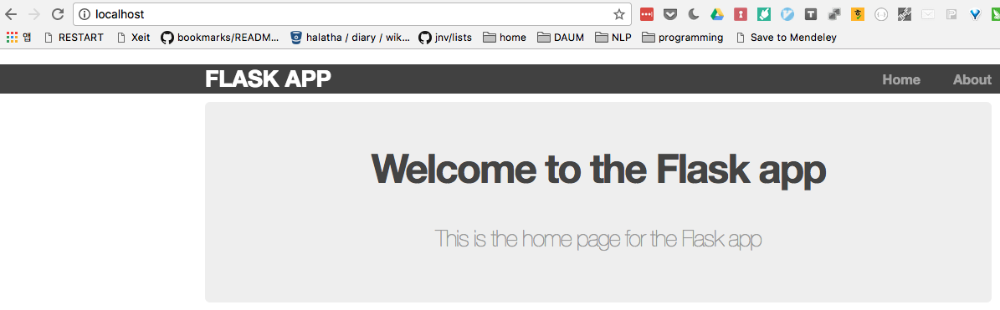

# Debian - Python - Mod_Wsgi

* Original repo; [https://github.com/Craicerjack/apache-flask](https://github.com/Craicerjack/apache-flask)
* Execution `docker run --rm -p 80:80 --name test-apache-flask apache-flask`, then [http://localhost](http://localhost)
  * 
* Installation `docker build -t apache-flask:latest .`
