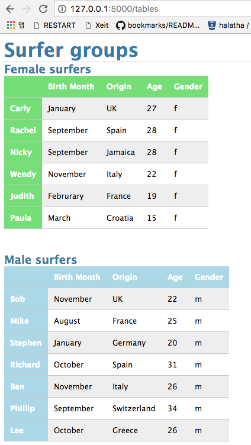

Table web app
=============

* Execution `docker run -p 5000:5000 table-web-app` then, [http://127.0.0.1:5000/tables](http://127.0.0.1:5000/tables)
  * 
* Installation `docker build -t table-web-app:latest .`
