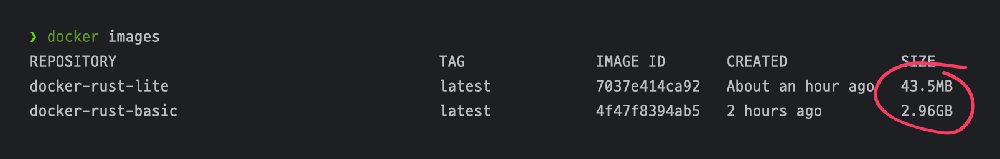
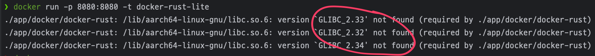

Docker-rust
===========
- build & execution

  ```
  docker build -f Dockerfile-basic . -t docker-rust-basic
  docker run -p 8080:8080 -t docker-rust-basic

  docker build -f Dockerfile-lite . -t docker-rust-lite
  docker run -p 8080:8080 -t docker-rust-lite
  ```
  - 
- Necessary to use appropriate version, e.g. when using `cc-debian11`, got this error
  - 